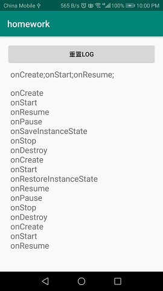

# Mobile Internet (android part) Chapter2 Assignment

BUPT Mobile Internet Course android part chapter2

- Android Studio：3.6.1
- Gradle：5.6.4
- Gradle Plugin：3.6.1

主要的几个java文件和apk文件复制了一份放在了本级文件夹下，方便查看。

## 0. preface

a. 对Exercise1进行了一点小魔改，在layout下增加了exercise.xml，更容易搞清楚生命周期都做了什么。

b. Exercise2写了一个非递归的广度优先搜索。

c. Exercise3用RecycleView完成，查看logcat验证每个item确实移出屏幕就被优化掉了。

瞎唠叨：这次感觉浪费了好多时间，主要还是没太搞懂Adapter和RecycleView的关系。然后就是由于并没有学过java，直接看代码虽然不是特别困难，但还是有点障碍，这次作业做完，java的语法（由于跟c++很像）基本问题不是很大了。


## 1. Exercise1

用一个static变量WholeLog来存储log，页面退出后仍然可以保存log。

Exercise1的页面中：

上方的TextView中的log记录了使用onSaveInstanceState方法保存log并用onRestoreInstanceState方法恢复时的记录下的log。

下方的ScrollView中的log记录了使用static变量存储log时记录下的log。

### a. 先把屏幕倒过来，刚进入时两个log记录的值相同


### b. 转动屏幕，可以发现上方没有记录onStop和onDestroy。


由于onStop和onDestroy在onSaveInstanceState之前执行，所以屏幕上方的log里并没有记录onStop和onDestroy。

### c. 按退出键退出该页面，再次进入之后：



上方的log重新开始记录，用static变量存的log仍然存在。

### d. 重新打开app进入Exercise1之后，退到桌面，再进入程序：


可见程序并没有被destroy，只执行了Stop。

## 2. Exercise2

用了比较基础的广度优先+队列，把ViewGroup放队列里，一个个拿出来扩展，找出来的ViewGroup再放队列里，直到队列为空。

```java
    public int getAllChildViewCount(View view) {
        //广度优先搜索，队列
        if (view == null){
            return 0;
        }
        int sum = 0;
        Queue<ViewGroup> queue = new LinkedList<ViewGroup>();
        if (view instanceof ViewGroup){
            ViewGroup viewGroup = (ViewGroup) view;
            queue.offer(viewGroup);
            while(queue.peek() != null){
                viewGroup = queue.poll();
                for (int i = 0; i < viewGroup.getChildCount(); i++){
                    if(viewGroup.getChildAt(i) instanceof ViewGroup){
                        queue.offer((ViewGroup) viewGroup.getChildAt(i));
                    }
                    else{
                        sum++;
                    }
                }
            }
        }
        else{
            sum++;
        }
        return sum;
    }
}
```

## 3. Exercise3

刚进入Exercise3的界面（惯例首行瞎吐槽）：


点击item之后转入的界面里提示这是第几个item：


回到原来的界面，上下滑动，看logcat就能发现移出屏幕的item被优化掉了（21->30，往回划出现20）：

